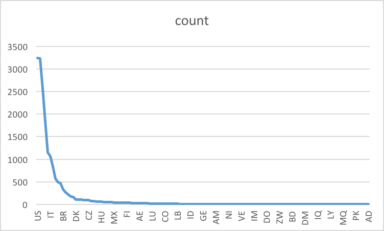
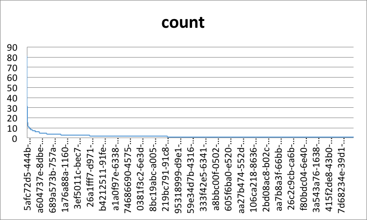
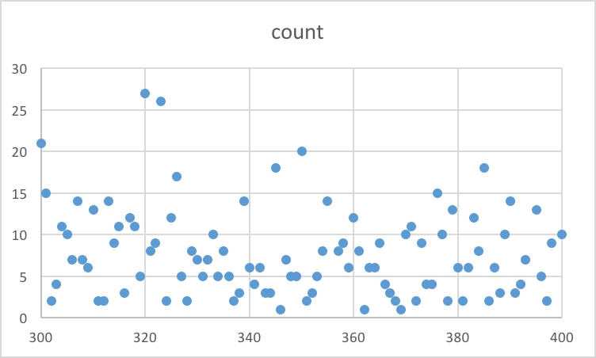
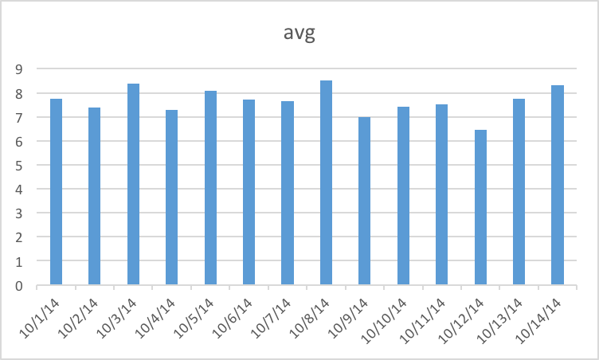

# ICA4

## Description of strata_user.airbnb_sq
Table contains the information about price, neighborhood every user searches.


## Question 1
How many people search for a host on Airbnb every day in a week? 

```sql
select ds,
    count (Distinct id_user) as count
from strata_user.airbnb_sq
where ds>='2014-10-01'and ds<='2014-10-07'
group by ds
```

 


## Question 2
Which origin coutry are people search in a week?

```sql
SELECT
origin_country,
count(Distinct id_user)
from strata_user.airbnb_sq
where ds>='2014-01-01'and ds<='2014-12-07'
group by origin_country
order by count DESC
```

 

## Question 3
How many time does each people search on Airbnb?

```sql
SELECT
id_user,
count(*)
from strata_user.airbnb_sq
group by id_user
order by count DESC
```

 

## Question 4
How many people could accept the max. price between 300 and 400

```sql
SELECT
filter_price_max,
count(*)
from strata_user.airbnb_sq
where filter_price_max <=400  and  filter_price_max >=300
group by filter_price_max
order by filter_price_max DESC
```

 


## Question 5
what is the average n_nights every day in a week?

```sql
SELECT
ds,
avg(n_nights)
from strata_user.airbnb_sq
where ds>='2014-01-01'and ds<='2014-12-07'
group by ds
order by ds ASC
```


 
