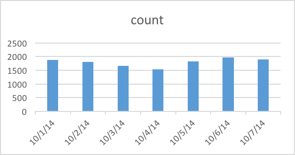

# ICA4

## Description of strata_user.airbnb_sq
Table contains the information about price, neighborhood every user searches.


## Question 1
How many people search for a host on Airbnb every day in a week? 

```sql
select ds,
    count (Distinct id_user) as count
from strata_user.airbnb_sq
where ds>='2014-10-01'and ds<='2014-10-07'
group by ds
```

 


## Question 2
